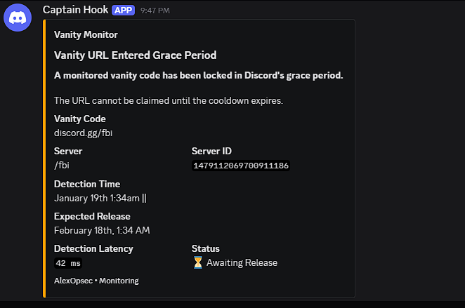

<p align="center">

  <br><br>
  <h1 align="center">discord-vanity-sniper</h1>
  <h3 align="center"> ultra-low latency vanity hunter with grace period auto-claimer</h3>
</p>

<p align="center">
  <a href="https://github.com/alexopsec/discord-vanity-sniper">
    
  </a>
  <a href="https://github.com/alexopsec/discord-vanity-sniper/forks">
    
  </a>
  <a href="https://github.com/alexopsec/discord-vanity-sniper/issues">
    
  </a>
  <a href="https://github.com/alexopsec/discord-vanity-sniper/graphs/contributors">
    
  </a>
</p>

<br>

<p align="center">
  <strong>Claim vanities faster than Discord can blink.</strong><br>
  Real-time drop detection → lightning-fast sniping → 30-day grace period memory → automatic reclaim when the timer hits zero.
</p>

<div align="center">
  
  <br>
  <em>The command center — clean, fast, deadly accurate.</em>
</div>

## 🔥 Core Powers

- ⚡ **~150–250 ms** claim latency (good ping = sub-200 ms snipes)
- 👁️‍🗨️ Real-time **GUILD_UPDATE** + **GUILD_DELETE** listening via Gateway
- 🕒 **Grace period oracle** — tracks dropped vanities for ~30 days
- 🔄 **Auto-Grace Claimer** — fires exactly when grace expires (ratelimit-aware retries)
- 💾 Persistent grace storage (`grace.json`) — survives restarts & hot-reloads
- 🔐 **MFA ninja mode** — auto-triggers & solves when needed
- 🛡️ Anti-locking + fingerprint spoofing (CycleTLS + JA3 + UA control)
- 🔄 Pre-warms connections + periodic MFA refresh
- 🪝 Discord webhook notifications on snipe / grace claim

## Quick Launch Sequence

```bash
# 1. Lock & load
git clone https://github.com/alexopsec/discord-vanity-sniper.git
cd discord-vanity-sniper

# 2. Install 
npm install

# 3. Fire
node main.js
```

## Troubleshooting

| Problem | Possible Solution |
|--------|------------------|
| MFA keeps failing | Check password is correct and the account is not locked |
| Claims fail with 429 | Rate limited |
| No grace detection | Ensure the monitor token and can see the guild |
| High latency | Use a better RDP connection or a VPS closer to Ashburn Virginia / NewYork |


